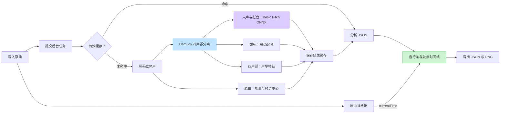

# Hya MVP 处理流程

```mermaid
flowchart LR
    source["导入原曲"] --> submit["提交后台任务"]
    submit --> cache{"有效缓存？"}
    cache -->|"命中"| result["分析 JSON"]
    cache -->|"未命中"| decode["解码立体声"]
    decode --> demucs["Demucs 四声部分离"]
    demucs --> pitch["人声与低音：Basic Pitch ONNX"]
    demucs --> drums["鼓轨：瞬态起音"]
    demucs --> features["四声部：声学特征"]
    decode --> mix["原曲：能量与频谱重心"]
    pitch --> store["保存结果缓存"]
    drums --> store
    features --> store
    mix --> store
    store --> result
    result --> canvas["音符条与鼓点时间线"]
    source --> player["原曲播放器"]
    player -->|"currentTime"| canvas
    canvas --> exportFile["导出 JSON 与 PNG"]
    style demucs fill:#C2E5FF,stroke:#3DADFF
    style pitch fill:#DCCCFF,stroke:#874FFF
    style canvas fill:#CDF4D3,stroke:#66D575
```

所有分析在本机完成。后台单进程顺序执行模型任务，界面轮询阶段进度；可取消或超时结束。原始上传及中间音频随任务清理，分析 JSON 留在 `outputs/cache/`。

四声部都保存声学特征；MVP 主视图显示人声、低音和鼓点。播放采用原曲 `currentTime`，不重新合成 MIDI，也不同时播放四条分轨。快速分析模式独立走旧版 FFT 管线。
